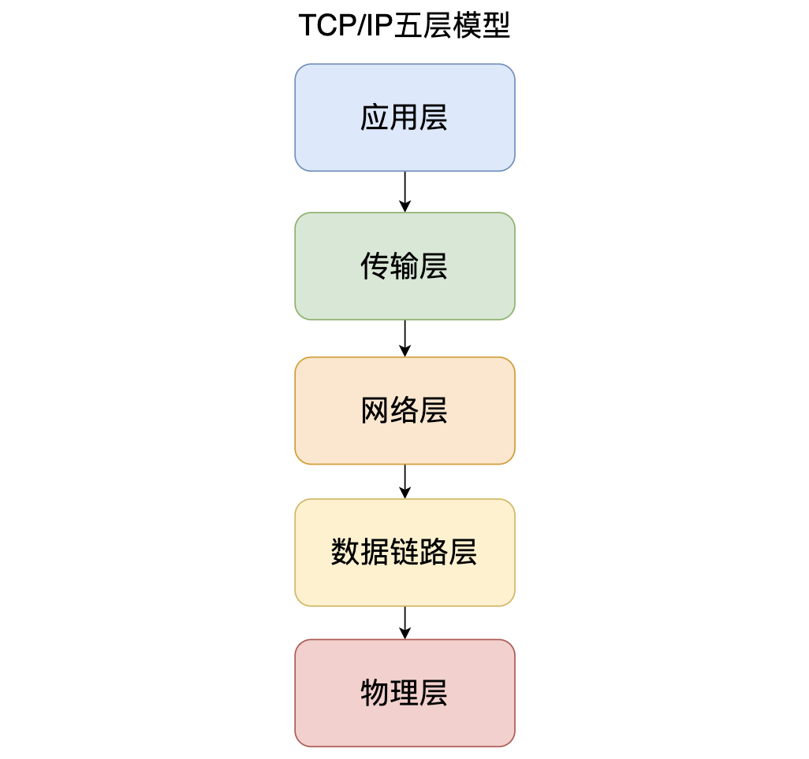
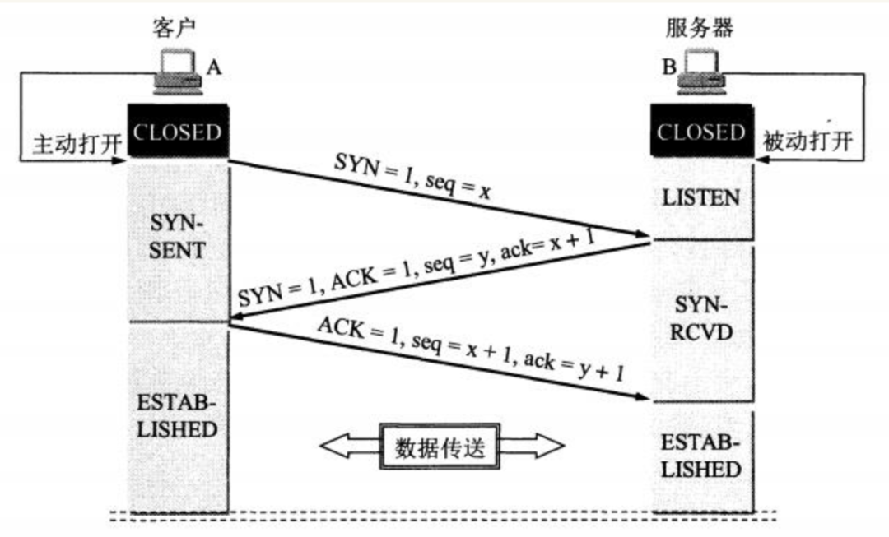
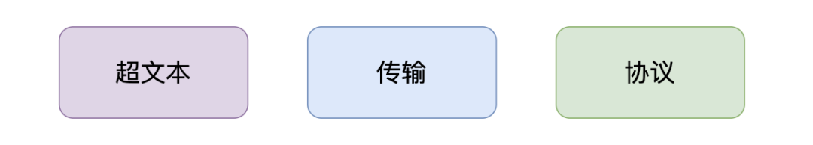

# DEMO面经

# 自我介绍
⾯试官你好，我叫XXX，现就职于XX直播，技术中台，多媒体技术部，所属岗位音视频SDK开发，实习岗位为流媒体开发工程师
主要负责多媒体项目的研发和维护。                                 
期间主要参与了XX融合音视频SDK项目；标准化音视频SDK项目；通用调度服务；录播、截图服务；成本结算服务；缩放图服务等。              

项目经历： 
主要介绍下融合音视频SDK项目：这个项目背景是XX业务不断更新迭代，老的SDK项目追随业务迭代过程中一直没有时间停下脚步
做必要的休整和沉淀，导致底层框架越来越模糊，和业务线耦合度纵横交错，逐渐失去稳定性、便捷性，维护成本较高严重影响业务进度、稳定性
和用户体验。                                    

开发一套ALL-IN-ONE的多功能、多方案全场景音视频SDK。涵盖RTC、CDN、美颜、信令、自研播放器、网络优选模块、诊断系统（高质量完善日志、埋点信息）、跨平台需求，iOS、Android、Flutter、macOS、Windows。                            
玩法：1v1（对应拨号、响铃、接通（A、B），SDK控制秒开、推拉流url）                
直播：（开播、拉流、PK、连麦）                  
多人（多人视频、多人音频）                        
常住房（房间没有房主概念）

我主要负责完成 Android 模块接口的设计及研发，采用 Cmake 集成方式；利用 JNI 技术完成 Java 与 C++ 交互，集成火山、zego SDK；完成XX自研和火山美颜SDK接入； 
利用 Flutter MethodChannel 技术完成 SDK在Flutter端拓展；参与编写 融合音视频 SDK 在 Android、Flutter端 Demo 工程， 便于使用者理解调用逻辑，体验功能，
实现4种RTC+美颜多人视频通话场景；

我也常常在⼀些平台活跃，像是github、gitee，平时写的学习项⽬都已经进⾏了git版本分⽀开发；也常常在
CSDN、博客园、掘⾦、简书、微信公众号发布⼀些知识点总结⽂章。

面试官大概就是这样。

# 音视频开发面试常问
## 熟悉TCP/UDP协议
### TCP/IP 网络模型有几层？分别有什么用？             

TCP/IP网络模型总共有`五层`

1.应用层:我们能接触到的就是应用层了，手机，电脑这些这些设备都属于应用层。

2.传输层:就是为应用层提供网络支持的，当设备作为接收⽅时，传输层则要负责把数据包传给应⽤，但是⼀台设备上可能会有很多应⽤在接收或者传输数据，因此需要⽤⼀个编号将应⽤区分开来，这个编号就是端⼝。所以 TCP 和 UDP 协议就是在这一层的

3.网络层:是负责传输数据的，最常使用的 ip 协议就在该层，⽹络层负责将数据从⼀个设备传输到另⼀个设备，世界上有很多设备，⽹络层需要有区分设备的编号。我们⼀般⽤ IP 地址给设备进⾏编号

4.数据链路层:每⼀台设备的⽹卡都会有⼀个 MAC 地址，它就是⽤来唯⼀标识设备的。路由器计算出了下⼀个⽬的地 IP 地址，再通过 ARP 协议找到该⽬的地的 MAC 地址，这样就知道这个 IP 地址是哪个设备的了。路由器就是通过数据链路层来知道这个 ip 地址是属于哪个设备的，它主要为⽹络层提供链路级别传输的服务。

5.物理层:当数据准备要从设备发送到⽹络的时候，需要把数据包转换成电信号，让其可以在物理介质中传输，它主要是为数据链路层提供⼆进制传输的服务。

### TCP 建立连接的过程是怎样的？

第一次握手:A 的 TCP 进程创建一个 传输控制块 TCB ，然后向 B 发出连接请求报文段。之后将同步位 SYN 设置为 1，同时选择一个初始序列号 seq=x，这时客户端 A 进入到 SYN-SENT（同步已发送）状态。

第二次握手:B 收到连接请求报文段，如果同意建立连接，则向 A 发送确认。在确认报文段中 同步位 SYN=1、确认位 ACK=1、确认号 ack=x+1，同时也为自己选择一个初始序列号 seq=y，这时服务器 B 进入 SYN-RCVID 状态。

第三次握手:A 收到 B 的确认以后，再向 B 发出确认。确认报文 ACK=1、确认号ack=y+1。这时A进入到 ESTAB-LISHED 状态。当B接收到A的确认后，也进入 ESTAB-LISHED 状态。连接建立完成
### 为什么是三次握手？？？

### 介绍一下 HTTP 协议吧

HTTP 协议是基于 TCP 协议实现的，它是一个超文本传输协议，其实就是一个简单的请求-响应协议，它指定了客户端可能发送给服务器什么样的消息以及得到什么样的响应。

它主要是负责点对点之间通信的。

超文本就是用超链接的方法，将各种不同空间的文字信息组织在一起的网状文本。比如说html，内部定义了很多图片视频的链接，放在浏览器上就呈现出了画面。

协议就是约定俗称的东西，比如说 moon 要给读者送一本书，读者那里只接受顺丰快递，那么 moon 觉得可以，发快递的时候选择的顺丰，那么我们彼此之间共同约定好的就叫做协议。

传输这个就很好理解了，比如刚才举的例子，将书发给读者，要通过骑车或者飞机的方式，传递的这个过程就是运输。

### PING 的作用？
PING 主要的作用就是测试在两台主机之间能否建立连接，如果 PING 不通就无法建立连接。

它其实就是向目的主机发送多个 ICMP 回送请求报文

如果没有响应则无法建立连接

如果有响应就可以根据目的主机返回的回送报文的时间和成功响应的次数估算出数据包往返时间及丢包率

## 熟悉RTMP/HLS/RTP等流媒体网络协议

### RTMP
RTMP(Real Time Messaging Protocol)实时消息传送协议是Adobe公司为Flash播放器和服务器之间音频、视频和数据传输开发的开放协议。RTMP工作在TCP之上，默认使用端口1935。

工作原理：RTMP 的 message 会切分为 n 个 chunk，再通过TCP协议传输。

为什么 rtmp 基于 tcp 协议，tcp 协议已经有化整为零的方式， rtmp 还需要将 message 划分更小的单元 chunk 呢？

分析原因：

1. tcp 协议划分一个个 tcp 报文，是为了在网络传输层上保障数据连续性，丢包重发等特性。

2. rtmp 划分 chunk 消息块，是为了在网络应用层上实现低延迟的特性，防止大的数据块(如视频数据)阻塞小的数据块(如音频数据或控制信息)。

## 熟悉音视频编码技术（AVC、HEVC、AAC等）、MediaCodec、VideoToolbox等技术

### AVC
AVC （高级视频编码Advanced Video Coding）

AVC是高级视频编码的简称（Advanced Video Coding），视频编解码技术有两套标准，H.261、国际电联（ITU-T）的标准H.263、H.263+等；还有ISO 的MPEG标准MPEG-1、MPEG-2、MPEG-4等等。

## FFmpeg、x264开源工程、ijkplayer、webrtc、gpuimage、ssr

## Android/iOS 音视频渲染图像处理

## 熟悉OpenGL、OpenCV

## webrtc相关研发经验

