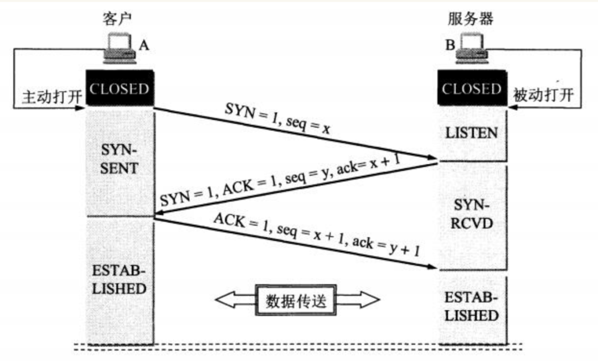

# DEMO面经

# 自我介绍
⾯试官你好，我叫XXX，现就职于XX直播，技术中台，多媒体技术部，所属岗位音视频SDK开发，实习岗位为流媒体开发工程师
主要负责多媒体项目的研发和维护。                                 
期间主要参与了XX融合音视频SDK项目；标准化音视频SDK项目；通用调度服务；录播、截图服务；成本结算服务；缩放图服务等。              

项目经历： 
主要介绍下融合音视频SDK项目：这个项目背景是XX业务不断更新迭代，老的SDK项目追随业务迭代过程中一直没有时间停下脚步
做必要的休整和沉淀，导致底层框架越来越模糊，和业务线耦合度纵横交错，逐渐失去稳定性、便捷性，维护成本较高严重影响业务进度、稳定性
和用户体验。                                    

开发一套ALL-IN-ONE的多功能、多方案全场景音视频SDK。涵盖RTC、CDN、美颜、信令、自研播放器、网络优选模块、诊断系统（高质量完善日志、埋点信息）、跨平台需求，iOS、Android、Flutter、macOS、Windows。                            
玩法：1v1（对应拨号、响铃、接通（A、B），SDK控制秒开、推拉流url）                
直播：（开播、拉流、PK、连麦）                  
多人（多人视频、多人音频）                        
常住房（房间没有房主概念）

我主要负责完成 Android 模块接口的设计及研发，采用 Cmake 集成方式；利用 JNI 技术完成 Java 与 C++ 交互，集成火山、zego SDK；完成XX自研和火山美颜SDK接入； 
利用 Flutter MethodChannel 技术完成 SDK在Flutter端拓展；参与编写 融合音视频 SDK 在 Android、Flutter端 Demo 工程， 便于使用者理解调用逻辑，体验功能，
实现4种RTC+美颜多人视频通话场景；

我也常常在⼀些平台活跃，像是github、gitee，平时写的学习项⽬都已经进⾏了git版本分⽀开发；也常常在
CSDN、博客园、掘⾦、简书、微信公众号发布⼀些知识点总结⽂章。

面试官大概就是这样。


# 简历知识点

## FFmpeg常见命令及API

### 目录

|—compat     该目录存放的是兼容文件，以便兼容早期版本
 |—doc      说明文档
 |—ffbuild
 |—`libavcodec`   音视频编解码核心库
 |—`libavdevice`  各种设备的输入输出，比如Video4Linux2, VfW, DShow以及 ALSA
 |—`libavfilter`  滤镜特效处理
 |—`libavformat`  I/O操作和封装格式(muxer/demuxer)处理
 |—`libavswresample` 音频重采样，格式转换和混音
 |—      (1) 重采样：改变音频的采样率，比如从44100HZ降低到8000HZ
 |—      (2)重新矩阵化：改变音频通道数量，比如从立体声道(stereo )变为单身道(mono)
 |—      (3)格式转换：改变音频采样大小，比如将每个样本大小从16bits降低到8bits
 |—`libavutil`   工具库，比如算数运算、字符操作等
 |—`libpostproc`  后期效果处理，如图像的去块效应
 |—`libswscale`   视频像素处理，包括缩放图像尺寸、色彩映射转换、像素颜色空间转换等
 |—presets
 |—tests      测试实例
 |—configure     配置文件，编译ffmpeg时用到

### 常见音视频概念

容器/文件（ Conainer/File）：特定格式的多媒体文件，比如mp4、 flv、 mkv等。

媒体流（ Stream）：表示时间轴上的一段连续数据，比如一段声音、一段视频或一段字幕；数据可以是压缩的，也可以是非压缩的，其中压缩的数据需要关联特定的编解码器。

数据帧/数据包（Frame/Packet）：一般一个媒体流是由大量的数据帧组成的，对于压缩数据，帧对应着编解码器的最小处理单元，分属于不同媒体流的数据帧交错存储于容器之中。

编解码器：编解码器是以帧为单位实现压缩数据和原始数据之间相互转换的。

复用器：音频流、视频流、字母流以及其他成分，按照一定的规则组合成视频文件（MP4/flv）。

解复用器：视频文件（MP4/flv）按照一定的规则拆分成，音频流、视频流、字母流以及其他成分。

**视频编解码器**


**音频编解码器**


### FFmpeg有8个常用库：

**AVUtil**：核心工具库，下面的许多其他模块都会依赖该库做一些基本的音视频处理操作。

**AVFormat**：文件格式和协议库，该模块是最重要的模块之一，**封装了Protocol层和Demuxer、Muxer层** ，使得协议和格式对于开发者来说是透明的。

**AVCodec**：编解码库，封装了Codec层，但是有一些Codec是具备自己的License的，FFmpeg是不会默认添加像libx264、FDK-AAC等库的，但是FFmpeg就像一个平台一样，可以**将其他的第三方的Codec以插件的方式添加进来，然后为开发者提供统一的接口。**

**AVFilter**：音视频滤镜库，该模块提供了包括音频特效和视频特效的处理，在使用FFmpeg的API进行编解码的过程中，直接使用**该模块为音视频数据做特效处理** 是非常方便同时也非常高效的一种方式。

**AVDevice**：**输入输出设备库** ，比如，需要编译出播放声音或者视频的工具ffplay，就需要确保该模块是打开的，同时也需要SDL的预先编译，因为该设备模块播放声音与播放视频使用的都是SDL库。

**SwrRessample**：该模块可用于音频重采样，可以对数字音频进行声道数、数据格式、采样率等多种基本信息的转换。

**SWScale**：该模块是将**图像进行格式转换** 的模块，比如，可以将**YUV的数据转换为RGB的数据，缩放尺寸由1280\*720变为800\*480。**

**PostProc**：该模块**可用于进行后期处理** ，当我们使用AVFilter的时候需要**打开该模块的开关** ，因为Filter中会使用到该模块的一些基础函数。

### 常用API函数

**1、注册、初始化相关函数**

avdevice_register_all()：对设备进行注册，如V4L2。

avformat_network_init()：初始化网络库，以及网络加密协议相关的库，如openSSL。

**2、封装格式相关函数**

avformat_alloc_context()：申请一个AVFormatContext结构的内存，并进行简单初始化。

avformat_free_context()：释放AVFormatContext结构的内存。

avformat_close_input()：关闭解复用器；关闭后就不再需要使用avformat_free_context()进行释放。

avformat_open_input()：打开输入视频文件。

avformat_find_stream_info()：获取音视频文件信息。

av_read_frame()：读取音视频包。

avformat_seek_file()：定位文件。

av_seek_frame()：定位文件。

**3、解码器相关**

avcodec_alloc_context3():分配解码器上下文。

avcodec_find_decoder()：根据ID查找解码器。

avcodec_find_decoder_by_name():根据名字查找解码器。

avcodec_open2()： 打开编解码器

avcodec_decode_video2()：解码一帧视频数据，该接口已被弃用。

avcodec_decode_audio4()：解码一帧音频数据，该接口已被弃用。

avcodec_send_packet():发送编码数据包。

avcodec_receive_frame():接收解码后数据。

avcodec_free_context():释放解码器上下文，包含了avcodec_close()。

avcodec_close():关闭解码器。

### 常用数据结构

**1、AVFormatContext**

封装格式上下文结构体，也是统领全局的结构体，保存了视频文件封装格式相关信息。

iformat：输入媒体的AVInputFormat，比如指向AVInputFormat ff_flv_demuxer

nb_streams：输入媒体的AVStream 个数

streams：输入媒体的AVStream []数组

duration：输入媒体的时长（以微秒为单位），计算方式可以参考av_dump_format()函数。

bit_rate：输入媒体的码率

**2、AVInputFormat**

每种封装格式（例如FLV, MKV, MP4, AVI）对应一个该结构体。

name：封装格式名称

extensions：封装格式的扩展名

id：封装格式ID

一些封装格式处理的接口函数,比如read_packet()

**3、AVStream**

视频文件中每个视频（音频）流对应一个该结构体。

index：标识该视频/音频流

time_base：该流的时基， PTS*time_base=真正的时间（秒）

avg_frame_rate： 该流的帧率

duration：该视频/音频流长度

codecpar：编解码器参数属性

**4、AVCodecParameters**

codec_type：媒体类型，比如AVMEDIA_TYPE_VIDEO AVMEDIA_TYPE_AUDIO等

codec_id：编解码器类型， 比如AV_CODEC_ID_H264AV_CODEC_ID_AAC等。

**5、AVCodecContext**

编解码器上下文结构体，保存了视频（音频）编解码相关信息。

codec：编解码器的AVCodec，比如指向AVCodec ff_aac_latm_decoder

width, height：图像的宽高（只针对视频）

pix_fmt：像素格式（只针对视频）

sample_rate：采样率（只针对音频）

channels：声道数（只针对音频）

sample_fmt：采样格式（只针对音频）

**6、AVCodec**

每种视频（音频）编解码器(例如H.264解码器)对应一个该结构体。

name：编解码器名称

type：编解码器类型

id：编解码器ID

一些编解码的接口函数，比如int (*decode)()

**7、AVPacket**

存储一帧压缩编码数据。

pts：显示时间戳

dts：解码时间戳

data：压缩编码数据

size：压缩编码数据大小

pos:数据的偏移地址

stream_index：所属的AVStream

**8、AVFrame**

存储一帧解码后像素（采样）数据。

data：解码后的图像像素数据（音频采样数据）

linesize：对视频来说是图像中一行像素的大小；对音频来说是整个音频帧的大小

width, height：图像的宽高（只针对视频）

key_frame：是否为关键帧（只针对视频） 。

pict_type：帧类型（只针对视频） 。例如I， P， B

sample_rate：音频采样率（只针对音频）

nb_samples：音频每通道采样数（只针对音频）

pts：显示时间戳

**9、AVOutputFormat**

1）描述

AVOutputFormat 表示输出文件容器格式，AVOutputFormat结构主要包含的信息有：

封装名称描述

编码格式信息（video/audio 默认编码格式，支持的编码格式列表）

对封装的操作函数（write_header,write_packet,write_tailer等）

ffmpeg支持各种各样的输出文件格式，MP4，FLV，3GP等。

AVOutputFormat结构保存了这些格式的信息和一些常规设置。

每一种封装对应一个AVOutputFormat结构，ffmpeg将AVOutputFormat按照链表存储：


### **常见变量及其作用**

```bash
const char *name; // 复⽤器名称
const char *long_name;//格式的描述性名称，易于阅读。
enum AVCodecID audio_codec; //默认的⾳频编解码器
enum AVCodecID video_codec; //默认的视频编解码器
enum AVCodecID subtitle_codec; //默认的字幕编解码器
```


## H264/AVC

**H264概述**

H264，是由ITU-T[视频编码](https://link.juejin.cn?target=https%3A%2F%2Fbaike.baidu.com%2Fitem%2F%E8%A7%86%E9%A2%91%E7%BC%96%E7%A0%81%2F839038)专家组（VCEG）和ISO/IEC动态图像专家组（MPEG）联合组成的联合视频组（JVT，Joint Video Team）提出的高度压缩数字[视频编解码器](https://link.juejin.cn?target=https%3A%2F%2Fbaike.baidu.com%2Fitem%2F%E8%A7%86%E9%A2%91%E7%BC%96%E8%A7%A3%E7%A0%81%E5%99%A8)标准。也可以被称为H.264/AVC（或者AVC/H.264或者H.264/MPEG-4 AVC或MPEG-4/H.264 AVC）。

**H264起源**

在 1988年 ITU-T发明了H261，ISO/IEC-MPEG 在 1991 年发明了 MPEG-1,都是用来做视频压缩的标准算法，但是这两个并不兼容，是不一样的东西，随着音视频的发展，在 2003年 这两个机构达成共识，组合成一个算法，H264/MPEG-4AVC,俗称H264。

**视频中那些地方可以压缩**？

- 空间冗余：比如一帧图片全是白色的话，我就存一个像素点的颜色就可以了
- 时间冗余：比如一个慢动作的视频，两个帧之间基本上一样，name只存一帧就可以了
- 视觉冗余：人类视觉对于图像的任何变化，并不是都能感知，
- 知识冗余：规律性的结构可由先验知识和背景知识得

**H264的压缩原理**

- 帧内压缩:根据帧内的像素趋于统一 而采用帧内预测编码技术
- 帧间压缩:使用以宏块为基础的运动补偿预测编码技术，从当前宏块从参考帧中产兆最佳匹配宏块


## H265/HEVC


## AAC


## FLV


# 音视频开发面试常问

## 熟悉TCP/UDP协议
### TCP/IP 网络模型有几层？分别有什么用？             

TCP/IP网络模型总共有`五层`

1.应用层: 我们能接触到的就是应用层了，手机，电脑这些这些设备都属于应用层。

2.传输层: 就是为应用层提供网络支持的，当设备作为接收⽅时，传输层则要负责把数据包传给应⽤，但是⼀台设备上可能会有很多应⽤在接收或者传输数据，因此需要⽤⼀个编号将应⽤区分开来，这个编号就是端⼝。所以 TCP 和 UDP 协议就是在这一层的

3.网络层: 是负责传输数据的，最常使用的 ip 协议就在该层，⽹络层负责将数据从⼀个设备传输到另⼀个设备，世界上有很多设备，⽹络层需要有区分设备的编号。我们⼀般⽤ IP 地址给设备进⾏编号

4.数据链路层: 每⼀台设备的⽹卡都会有⼀个 MAC 地址，它就是⽤来唯⼀标识设备的。路由器计算出了下⼀个⽬的地 IP 地址，再通过 ARP 协议找到该⽬的地的 MAC 地址，这样就知道这个 IP 地址是哪个设备的了。路由器就是通过数据链路层来知道这个 ip 地址是属于哪个设备的，它主要为⽹络层提供链路级别传输的服务。

5.物理层: 当数据准备要从设备发送到⽹络的时候，需要把数据包转换成电信号，让其可以在物理介质中传输，它主要是为数据链路层提供⼆进制传输的服务。

### TCP 建立连接的过程是怎样的？

第一次握手:A 的 TCP 进程创建一个 传输控制块 TCB ，然后向 B 发出连接请求报文段。之后将同步位 SYN 设置为 1，同时选择一个初始序列号 seq=x，这时客户端 A 进入到 SYN-SENT（同步已发送）状态。

第二次握手:B 收到连接请求报文段，如果同意建立连接，则向 A 发送确认。在确认报文段中 同步位 SYN=1、确认位 ACK=1、确认号 ack=x+1，同时也为自己选择一个初始序列号 seq=y，这时服务器 B 进入 SYN-RCVID 状态。

第三次握手:A 收到 B 的确认以后，再向 B 发出确认。确认报文 ACK=1、确认号ack=y+1。这时A进入到 ESTAB-LISHED 状态。当B接收到A的确认后，也进入 ESTAB-LISHED 状态。连接建立完成
### 为什么是三次握手？？？


### 介绍一下 HTTP 协议吧

HTTP 协议是基于 TCP 协议实现的，它是一个超文本传输协议，其实就是一个简单的请求-响应协议，它指定了客户端可能发送给服务器什么样的消息以及得到什么样的响应。

它主要是负责点对点之间通信的。

超文本就是用超链接的方法，将各种不同空间的文字信息组织在一起的网状文本。比如说html，内部定义了很多图片视频的链接，放在浏览器上就呈现出了画面。

协议就是约定俗称的东西，比如说 moon 要给读者送一本书，读者那里只接受顺丰快递，那么 moon 觉得可以，发快递的时候选择的顺丰，那么我们彼此之间共同约定好的就叫做协议。

传输这个就很好理解了，比如刚才举的例子，将书发给读者，要通过骑车或者飞机的方式，传递的这个过程就是运输。

### PING 的作用？
PING 主要的作用就是测试在两台主机之间能否建立连接，如果 PING 不通就无法建立连接。

它其实就是向目的主机发送多个 ICMP 回送请求报文

如果没有响应则无法建立连接

如果有响应就可以根据目的主机返回的回送报文的时间和成功响应的次数估算出数据包往返时间及丢包率

## 熟悉RTMP/HLS/RTP等流媒体网络协议

### RTMP
RTMP(Real Time Messaging Protocol)实时消息传送协议是Adobe公司为Flash播放器和服务器之间音频、视频和数据传输开发的开放协议。RTMP工作在TCP之上，默认使用端口1935。

工作原理：RTMP 的 message 会切分为 n 个 chunk，再通过TCP协议传输。

为什么 rtmp 基于 tcp 协议，tcp 协议已经有化整为零的方式， rtmp 还需要将 message 划分更小的单元 chunk 呢？

分析原因：

1. tcp 协议划分一个个 tcp 报文，是为了在网络传输层上保障数据连续性，丢包重发等特性。

2. rtmp 划分 chunk 消息块，是为了在网络应用层上实现低延迟的特性，防止大的数据块(如视频数据)阻塞小的数据块(如音频数据或控制信息)。


## 熟悉音视频编码技术（AVC、HEVC、AAC等）、MediaCodec、VideoToolbox等技术

### AVC
AVC （高级视频编码Advanced Video Coding）

AVC是高级视频编码的简称（Advanced Video Coding），视频编解码技术有两套标准，H.261、国际电联（ITU-T）的标准H.263、H.263+等；还有ISO 的MPEG标准MPEG-1、MPEG-2、MPEG-4等等。


## FFmpeg、x264开源工程、ijkplayer、webrtc、gpuimage、ssr


## Android/iOS 音视频渲染图像处理


## 熟悉OpenGL、OpenCV


## webrtc相关研发经验


