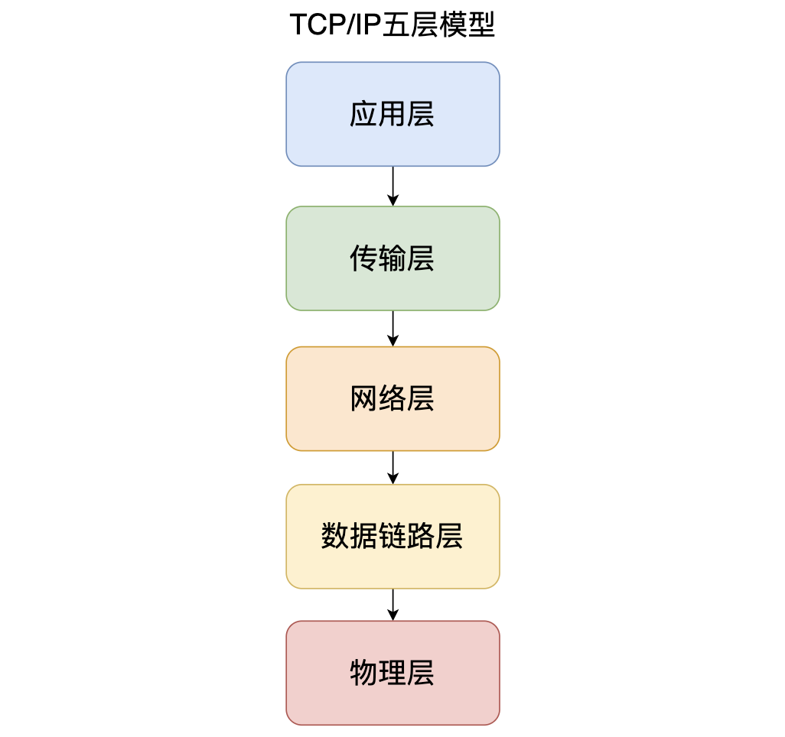

# DEMO面经

# 自我介绍
⾯试官你好，我叫XXX，现就职于XX直播，技术中台，多媒体技术部，所属岗位音视频SDK开发，实习岗位为流媒体开发工程师
主要负责多媒体项目的研发和维护。                                 
期间主要参与了XX融合音视频SDK项目；标准化音视频SDK项目；通用调度服务；录播、截图服务；成本结算服务；缩放图服务等。              

项目经历： 
主要介绍下融合音视频SDK项目：这个项目背景是XX业务不断更新迭代，老的SDK项目追随业务迭代过程中一直没有时间停下脚步
做必要的休整和沉淀，导致底层框架越来越模糊，和业务线耦合度纵横交错，逐渐失去稳定性、便捷性，维护成本较高严重影响业务进度、稳定性
和用户体验。                                    

开发一套ALL-IN-ONE的多功能、多方案全场景音视频SDK。涵盖RTC、CDN、美颜、信令、自研播放器、网络优选模块、诊断系统（高质量完善日志、埋点信息）、跨平台需求，iOS、Android、Flutter、macOS、Windows。                            
玩法：1v1（对应拨号、响铃、接通（A、B），SDK控制秒开、推拉流url）                
直播：（开播、拉流、PK、连麦）                  
多人（多人视频、多人音频）                        
常住房（房间没有房主概念）

我主要负责完成 Android 模块接口的设计及研发，采用 Cmake 集成方式；利用 JNI 技术完成 Java 与 C++ 交互，集成火山、zego SDK；完成XX自研和火山美颜SDK接入； 
利用 Flutter MethodChannel 技术完成 SDK在Flutter端拓展；参与编写 融合音视频 SDK 在 Android、Flutter端 Demo 工程， 便于使用者理解调用逻辑，体验功能，
实现4种RTC+美颜多人视频通话场景；

我也常常在⼀些平台活跃，像是github、gitee，平时写的学习项⽬都已经进⾏了git版本分⽀开发；也常常在
CSDN、博客园、掘⾦、简书、微信公众号发布⼀些知识点总结⽂章。

面试官大概就是这样。


# 简历知识点

## FFmpeg常见命令及API

### 目录

|—compat     该目录存放的是兼容文件，以便兼容早期版本
 |—doc      说明文档
 |—ffbuild
 |—`libavcodec`   音视频编解码核心库
 |—`libavdevice`  各种设备的输入输出，比如Video4Linux2, VfW, DShow以及 ALSA
 |—`libavfilter`  滤镜特效处理
 |—`libavformat`  I/O操作和封装格式(muxer/demuxer)处理
 |—`libavswresample` 音频重采样，格式转换和混音
 |—      (1) 重采样：改变音频的采样率，比如从44100HZ降低到8000HZ
 |—      (2)重新矩阵化：改变音频通道数量，比如从立体声道(stereo )变为单身道(mono)
 |—      (3)格式转换：改变音频采样大小，比如将每个样本大小从16bits降低到8bits
 |—`libavutil`   工具库，比如算数运算、字符操作等
 |—`libpostproc`  后期效果处理，如图像的去块效应
 |—`libswscale`   视频像素处理，包括缩放图像尺寸、色彩映射转换、像素颜色空间转换等
 |—presets
 |—tests      测试实例
 |—configure     配置文件，编译ffmpeg时用到

### 常见音视频概念

容器/文件（ Conainer/File）：特定格式的多媒体文件，比如mp4、 flv、 mkv等。

媒体流（ Stream）：表示时间轴上的一段连续数据，比如一段声音、一段视频或一段字幕；数据可以是压缩的，也可以是非压缩的，其中压缩的数据需要关联特定的编解码器。

数据帧/数据包（Frame/Packet）：一般一个媒体流是由大量的数据帧组成的，对于压缩数据，帧对应着编解码器的最小处理单元，分属于不同媒体流的数据帧交错存储于容器之中。

编解码器：编解码器是以帧为单位实现压缩数据和原始数据之间相互转换的。

复用器：音频流、视频流、字母流以及其他成分，按照一定的规则组合成视频文件（MP4/flv）。

解复用器：视频文件（MP4/flv）按照一定的规则拆分成，音频流、视频流、字母流以及其他成分。

**视频编解码器**


**音频编解码器**


### FFmpeg有8个常用库：

**AVUtil**：核心工具库，下面的许多其他模块都会依赖该库做一些基本的音视频处理操作。

**AVFormat**：文件格式和协议库，该模块是最重要的模块之一，**封装了Protocol层和Demuxer、Muxer层** ，使得协议和格式对于开发者来说是透明的。

**AVCodec**：编解码库，封装了Codec层，但是有一些Codec是具备自己的License的，FFmpeg是不会默认添加像libx264、FDK-AAC等库的，但是FFmpeg就像一个平台一样，可以**将其他的第三方的Codec以插件的方式添加进来，然后为开发者提供统一的接口。**

**AVFilter**：音视频滤镜库，该模块提供了包括音频特效和视频特效的处理，在使用FFmpeg的API进行编解码的过程中，直接使用**该模块为音视频数据做特效处理** 是非常方便同时也非常高效的一种方式。

**AVDevice**：**输入输出设备库** ，比如，需要编译出播放声音或者视频的工具ffplay，就需要确保该模块是打开的，同时也需要SDL的预先编译，因为该设备模块播放声音与播放视频使用的都是SDL库。

**SwrRessample**：该模块可用于音频重采样，可以对数字音频进行声道数、数据格式、采样率等多种基本信息的转换。

**SWScale**：该模块是将**图像进行格式转换** 的模块，比如，可以将**YUV的数据转换为RGB的数据，缩放尺寸由1280\*720变为800\*480。**

**PostProc**：该模块**可用于进行后期处理** ，当我们使用AVFilter的时候需要**打开该模块的开关** ，因为Filter中会使用到该模块的一些基础函数。

### 常用API函数

**1、注册、初始化相关函数**

avdevice_register_all()：对设备进行注册，如V4L2。

avformat_network_init()：初始化网络库，以及网络加密协议相关的库，如openSSL。

**2、封装格式相关函数**

avformat_alloc_context()：申请一个AVFormatContext结构的内存，并进行简单初始化。

avformat_free_context()：释放AVFormatContext结构的内存。

avformat_close_input()：关闭解复用器；关闭后就不再需要使用avformat_free_context()进行释放。

avformat_open_input()：打开输入视频文件。

avformat_find_stream_info()：获取音视频文件信息。

av_read_frame()：读取音视频包。

avformat_seek_file()：定位文件。

av_seek_frame()：定位文件。

**3、解码器相关**

avcodec_alloc_context3():分配解码器上下文。

avcodec_find_decoder()：根据ID查找解码器。

avcodec_find_decoder_by_name():根据名字查找解码器。

avcodec_open2()： 打开编解码器

avcodec_decode_video2()：解码一帧视频数据，该接口已被弃用。

avcodec_decode_audio4()：解码一帧音频数据，该接口已被弃用。

avcodec_send_packet():发送编码数据包。

avcodec_receive_frame():接收解码后数据。

avcodec_free_context():释放解码器上下文，包含了avcodec_close()。

avcodec_close():关闭解码器。

### 常用数据结构

**1、AVFormatContext**

封装格式上下文结构体，也是统领全局的结构体，保存了视频文件封装格式相关信息。

iformat：输入媒体的AVInputFormat，比如指向AVInputFormat ff_flv_demuxer

nb_streams：输入媒体的AVStream 个数

streams：输入媒体的AVStream []数组

duration：输入媒体的时长（以微秒为单位），计算方式可以参考av_dump_format()函数。

bit_rate：输入媒体的码率

**2、AVInputFormat**

每种封装格式（例如FLV, MKV, MP4, AVI）对应一个该结构体。

name：封装格式名称

extensions：封装格式的扩展名

id：封装格式ID

一些封装格式处理的接口函数,比如read_packet()

**3、AVStream**

视频文件中每个视频（音频）流对应一个该结构体。

index：标识该视频/音频流

time_base：该流的时基， PTS*time_base=真正的时间（秒）

avg_frame_rate： 该流的帧率

duration：该视频/音频流长度

codecpar：编解码器参数属性

**4、AVCodecParameters**

codec_type：媒体类型，比如AVMEDIA_TYPE_VIDEO AVMEDIA_TYPE_AUDIO等

codec_id：编解码器类型， 比如AV_CODEC_ID_H264AV_CODEC_ID_AAC等。

**5、AVCodecContext**

编解码器上下文结构体，保存了视频（音频）编解码相关信息。

codec：编解码器的AVCodec，比如指向AVCodec ff_aac_latm_decoder

width, height：图像的宽高（只针对视频）

pix_fmt：像素格式（只针对视频）

sample_rate：采样率（只针对音频）

channels：声道数（只针对音频）

sample_fmt：采样格式（只针对音频）

**6、AVCodec**

每种视频（音频）编解码器(例如H.264解码器)对应一个该结构体。

name：编解码器名称

type：编解码器类型

id：编解码器ID

一些编解码的接口函数，比如int (*decode)()

**7、AVPacket**

存储一帧压缩编码数据。

pts：显示时间戳

dts：解码时间戳

data：压缩编码数据

size：压缩编码数据大小

pos:数据的偏移地址

stream_index：所属的AVStream

**8、AVFrame**

存储一帧解码后像素（采样）数据。

data：解码后的图像像素数据（音频采样数据）

linesize：对视频来说是图像中一行像素的大小；对音频来说是整个音频帧的大小

width, height：图像的宽高（只针对视频）

key_frame：是否为关键帧（只针对视频） 。

pict_type：帧类型（只针对视频） 。例如I， P， B

sample_rate：音频采样率（只针对音频）

nb_samples：音频每通道采样数（只针对音频）

pts：显示时间戳

**9、AVOutputFormat**

1）描述

AVOutputFormat 表示输出文件容器格式，AVOutputFormat结构主要包含的信息有：

封装名称描述

编码格式信息（video/audio 默认编码格式，支持的编码格式列表）

对封装的操作函数（write_header,write_packet,write_tailer等）

ffmpeg支持各种各样的输出文件格式，MP4，FLV，3GP等。

AVOutputFormat结构保存了这些格式的信息和一些常规设置。

每一种封装对应一个AVOutputFormat结构，ffmpeg将AVOutputFormat按照链表存储：


### **常见变量及其作用**

```bash
const char *name; // 复⽤器名称
const char *long_name;//格式的描述性名称，易于阅读。
enum AVCodecID audio_codec; //默认的⾳频编解码器
enum AVCodecID video_codec; //默认的视频编解码器
enum AVCodecID subtitle_codec; //默认的字幕编解码器
```


## H264/AVC

### **H264概述**

H264，是由ITU-T[视频编码](https://link.juejin.cn?target=https%3A%2F%2Fbaike.baidu.com%2Fitem%2F%E8%A7%86%E9%A2%91%E7%BC%96%E7%A0%81%2F839038)专家组（VCEG）和ISO/IEC动态图像专家组（MPEG）联合组成的联合视频组（JVT，Joint Video Team）提出的高度压缩数字[视频编解码器](https://link.juejin.cn?target=https%3A%2F%2Fbaike.baidu.com%2Fitem%2F%E8%A7%86%E9%A2%91%E7%BC%96%E8%A7%A3%E7%A0%81%E5%99%A8)标准。也可以被称为H.264/AVC（或者AVC/H.264或者H.264/MPEG-4 AVC或MPEG-4/H.264 AVC）。

### **H264起源**

在 1988年 ITU-T发明了H261，ISO/IEC-MPEG 在 1991 年发明了 MPEG-1,都是用来做视频压缩的标准算法，但是这两个并不兼容，是不一样的东西，随着音视频的发展，在 2003年 这两个机构达成共识，组合成一个算法，H264/MPEG-4AVC,俗称H264。

### **视频中那些地方可以压缩**？

- 空间冗余：比如一帧图片全是白色的话，我就存一个像素点的颜色就可以了
- 时间冗余：比如一个慢动作的视频，两个帧之间基本上一样，name只存一帧就可以了
- 视觉冗余：人类视觉对于图像的任何变化，并不是都能感知，
- 知识冗余：规律性的结构可由先验知识和背景知识得

### **H264的压缩原理**

- 帧内压缩:根据帧内的像素趋于统一 而采用帧内预测编码技术
- 帧间压缩:使用以宏块为基础的运动补偿预测编码技术，从当前宏块从参考帧中产兆最佳匹配宏块

### 宏块

比如一个由左到右的一个黑白渐变的图片 我们就不用把所有的像素给存起来，我们可以把所有的像素，分成16*16的方块，在这个16*16的方块中我们只需记住top 和 left的像素值，宽高，起始和终止位置，这样我们就可以推算出所有的像素了。这样大大减少了内存，也就是一帧图片如果16*16的比较多，那么压缩出来的体积就越小，

### 关键帧

I帧：I帧可以看成是一个图像经过压缩后的产物。自身可以通过视频解压算法解压成一张单独的完整的图片。大概压缩了 1/6

P帧：与I帧作参考，这里面只有运动矢量，和差异的内容，压缩了 1/20，P帧也可以作为参考，前提是这个P帧前面有I帧，假如直播刚进来，BPBBI，此时这个P帧就算当做了参考也没用，必须有I帧才行

B帧: B帧是由前面的I帧或P帧和后面的P帧来进行预测的。只有矢量，1/50

### GOP

就是两个I帧之间间隔的帧数。 也就是说一个视频第一帧一定是I帧，如果不是I帧，则会黑屏一会，因为I帧是决定的一帧，比如直播的时候，我们一进来如果是P帧的话，就会黑屏，直到第一个I帧出现， 在短视频中I帧越少，GOP值越大，压缩出来的体积就越小，但是在直播的过程中，我们不能把GOP设置那么的大，因为大了的话会影响第一次进来的黑屏的概率会变大。所以直播的GOP是比较哦小

### SPS 和 PPS

sps 配置信息（宽高帧率分辨率，编码方式等等），pps(只有宽高) 也就是说I帧之前肯定有 sps和pps帧，每帧都是通过 0x000001 分割的。

### 码流总体结构

分为两层： 视频编码层(VCL)和网络提取层/网络抽象层(NAL)(磁盘也可以认为他，没有网络也有他)。


H.264 的编码视频序列包括一系列的NAL 单元，每个NAL 单元包含一个RBSP。一个原始的H.264 由N个NALU单元组成、 NALU 单元常由 [StartCode] [NALU Header] [NALU Payload] 三部分组 成，其中 Start Code 用于标示这是一个NALU 单元的开始，必须是"00 00 00 01" 或"00 00 01"

#### 网络传输 NAL

分隔符 0x000001 就在 NAL中。如果NALU对应的Slice为一帧的开始，则用4字节表示，即0x00000001;否则用3字节表示， 0x000001。 NAL Header:forbidden_bit，nal_reference_bit(优先级)，nal_unit_type(类型)。 脱壳操作:为了使NALU主体不包括起始码，在编码时每遇到两个字节(连续)的0，就插入一字节 0x03，以和起始码相区别。解码时，则将相应的0x03删除掉。

### 什么视频编码采用YUV而不是rgb

**rgb原理**： 定义RGB 是从颜色发光的原理来设计定的，由红、绿、蓝三盏灯，当它们的光相互叠合的时候，色彩相混，而亮度却等于两者亮度之总和（两盏灯的亮度嘛！），越混合亮度越高，即加法混合。RGB24 是指 R ， G ， B 三个分量各占 8 位 也就是 3个字节

1280 * 720 * 3(一个像素3个字节) / 1024 / 1024 = 2.63MB

YUV：原理是把亮度和色度分离，人眼对亮度的敏感度超过色度。YUV三个字母中，其中”Y”表示明亮度（Lumina nce或Luma），也就是灰阶值；而”U”和”V”表示的则是色度（Chrominance或Chroma），作用是描述影像色彩及饱和度，用于指定像素的颜色。

YUV 主要用于优化彩色视频信号的传输，与 RGB 视频信号传输相比，它最大的优点在于只需占用极少的频宽（ RGB 要求三个独立的视频信号同时传输）其中 “Y” 表示明亮度也就是灰阶值；而 “U” 和 “V” 表示的则是色度

1280 * 720 * 2(一个像素2个字节) / 1024 / 1024 = 1.76MB 使用 YUV4:2:2 节省了 1/3

## H265/HEVC

在码流、编码质量、算法上有了相当大的改善和优化，最终效果为仅需原先的一半带宽即可播放视觉效果相同的视频。


### H264 和 H265 区别

#### 版本

H.265是新的编码协议，也即是H.264的升级版，H265 对CPU的要求比较高，比较适合4K或者 8K的电影。

#### 降码率 和 存储空间

H.264中每个宏块（macroblock/MB）大小都是固定的16x16像素，而H.265的编码单位可以选择从最小的8x8到最大的64x64； 所以H264 比较占内存，

#### 采用了块的四叉树划分结构

H.265相比H.264最主要的改变是采用了块的四叉树划分结构，采用了从64x64~8x8像素的自适应块划分，并基于这种块划分结构采用一系列自适应的预测和变换等编码技术；比如一个不复杂的64*64 直接就一个大块，复杂点的先分成 4 个 8x8的，然后再看谁复杂 就在分谁，最终到4x4。

#### 帧

I帧会265会比264大，树形编码会增加复杂度 ，额外信息比较多，B帧 P帧 比264 小很多。

#### 帧内预测

h264 的预测方向 有 9中， h265 会有35种方向，更精确。


## AAC

### 概述

AAC，全称Advanced Audio Coding，是一种专为声音数据设计的文件压缩格式。与MP3不同，它采用了全新的算法进行编码，更加高效，具有更高的“性价比”。利用AAC格式，可使人感觉声音质量没有明显降低的前提下，更加小巧。苹果手机是首先都支持AAC格式的音频文件的。

AAC被iPhone、iTunes以及大多数便携式设备所使用。
AAC有很多的选项和profiles。

### 帧格式

AAC音频格式有：

ADIF(Audio Data Interchage Format)，音频数据交换格式：只有一个统一的头，必须得到所有数据后解码，适用于本地文件。

ADTS(Audio Data Transport Stream)，音视数据传输流：每一帧都有头信息，任意帧解码，适用于传输流。

下面主要介绍ADTS。

ADTS的组成单元是ADTS Frame。


- ADTS Frame由ADTS_Header和AAC ES组成。
- ADTS_Header包含采样率、声道数、帧长度的信息。
- ADTS头信息的长度是7个字节或9字节（有CRC的情况）。

ADTS_Header的可以分为以下三部分：

- adts_fixed_header：每一帧的内容是不变的。
- adts_variable_header：每一帧的内容是存在变化的。
- crc：16bits，protection_absent字段为0时存在。

**adts_fixed_header：**

| 字段                     | 比特数 | 说明                                                   |
| ------------------------ | ------ | ------------------------------------------------------ |
| syncword                 | 12     | 所有位必须为1，即0xFFF。                               |
| ID                       | 1      | 0代表MPEG-4, 1代表MPEG-2。                             |
| layer                    | 2      | 所有位必须为0。                                        |
| protection_absent        | 1      | 1代表没有CRC，0代表有。                                |
| profile                  | 2      | 配置级别                                               |
| sampling_frequency_index | 4      | 标识使用的采样频率，具体见下表Table35。                |
| private_bit              | 1      | see ISO/IEC 11172-3, subclause 2.4.2.3 (Table 8).      |
| channel_configuration    | 3      | 取值为0时，通过inband 的PCE设置channel configuration。 |
| original/copy            | 1      | 编码时设置为0，解码时忽略。                            |
| home                     | 1      | 编码时设置为0，解码时忽略。                            |

在MPEG-2 AAC中定义了3种profile：

- MPEG-2 AAC Main
- MPEG-2 AAC LC (Low Complexity)
- MPEG-2 AAC SSR (Scalable Sampling Rate)

在MPEG-4 AAC中定义了6种profile：

- MPEG-4 AAC Main

- MPEG-4 AAC LC (Low Complexity)

- MPEG-4 AAC SSR (Scalable Sample Rate)

- MPEG-4 AAC LTP (Long Term Predicition)

- MPEG-4 AAC LD (Low Delay)

- MPEG-4 AAC HE (High Efficiency) AACPlusV1/V2(3GPP)

**adts_variable_header：**

| 字段                               | 比特数 | 说明                                                         |
| ---------------------------------- | ------ | ------------------------------------------------------------ |
| copyright_identification_bit       | 1      | 编码时设置为0，解码时忽略。                                  |
| copyright_identification_start     | 1      | 编码时设置为0，解码时忽略                                    |
| frame_length                       | 13     | 帧长度，包括header和crc的长度，单位byte                      |
| adts_buffer_fullness               | 11     |                                                              |
| number_of_raw_data_blocks_in_frame | 2      | number of AAC Frames(RDBs) in ADTS frame minus 1, 为了最大的兼容性通常每个ADTS frame 包含一个AAC frame。 |


**AAC ES部分说明**

1. 一个frame的原始数据包含1024个样本时间段的音频数据。

ffmpeg中添加ADTS头的代码，可以很清晰的了解ADTS头的结构：

```cpp
static int adts_write_frame_header(ADTSContext *ctx,
                                   uint8_t *buf, int size, int pce_size)
{
    PutBitContext pb;

    unsigned full_frame_size = (unsigned)ADTS_HEADER_SIZE + size + pce_size;
    if (full_frame_size > ADTS_MAX_FRAME_BYTES) {
        av_log(NULL, AV_LOG_ERROR, "ADTS frame size too large: %u (max %d)\n",
               full_frame_size, ADTS_MAX_FRAME_BYTES);
        return AVERROR_INVALIDDATA;
    }

    init_put_bits(&pb, buf, ADTS_HEADER_SIZE);

    /* adts_fixed_header */
    put_bits(&pb, 12, 0xfff);   /* syncword */
    put_bits(&pb, 1, 0);        /* ID */
    put_bits(&pb, 2, 0);        /* layer */
    put_bits(&pb, 1, 1);        /* protection_absent */
    put_bits(&pb, 2, ctx->objecttype); /* profile_objecttype */
    put_bits(&pb, 4, ctx->sample_rate_index);
    put_bits(&pb, 1, 0);        /* private_bit */
    put_bits(&pb, 3, ctx->channel_conf); /* channel_configuration */
    put_bits(&pb, 1, 0);        /* original_copy */
    put_bits(&pb, 1, 0);        /* home */

    /* adts_variable_header */
    put_bits(&pb, 1, 0);        /* copyright_identification_bit */
    put_bits(&pb, 1, 0);        /* copyright_identification_start */
    put_bits(&pb, 13, full_frame_size); /* aac_frame_length */
    put_bits(&pb, 11, 0x7ff);   /* adts_buffer_fullness */
    put_bits(&pb, 2, 0);        /* number_of_raw_data_blocks_in_frame */

    flush_put_bits(&pb);

    return 0;
}
```

### 算法简介

AAC是一种[宽带](https://en.wikipedia.org/wiki/Wideband_audio)音频编码算法，它利用两种主要的编码策略来大幅减少表示高质量数字音频所需的数据量：

- 丢弃在感知上不相关的信号分量。
- 消除了编码音频信号中的冗余。

实际的编码过程包括以下步骤：

- 使用前向修改的离散余弦变换（MDCT）将信号从时域转换到频域。这是通过使用滤波器组来完成的，这些滤波器组采用适当数量的时间采样并将其转换为频率采样。
-  基于心理声学模型量化频域信号并对其进行编码。 
- 添加内部纠错码。 
- 存储或传输信号。 
- 为了防止损坏的样本，将Luhn mod N算法的现代实现应用于每个帧。 

### 开源软件

FAAD2：开源的MPEG-4和MPEG-2 AAC解码器。

fdk-aac：Fraunhofer IIS

### AAC和MP3的关键性不同

AAC是在MP3基础上开发出来的，所以两者的编码系统有一些相同之处。但是对比一下两者的编码流程图，你会发现AAC的编码工序更为复杂。

- 滤波器组（Filter bank）：

- 时域噪音修整（Temporal Noise Shaping，TNS）：这项神奇的技术可以通过在频率域上的预测，来修整时域上的量化噪音的分布。在一些特殊的语音和剧烈变化信号的量化上，TNS技术对音质的提高贡献巨大！
- 预测（Prediction）：对音频信号进行预测可以减少重复冗余信号的处理，提高效率。
- 量化（Quantization）：AAC的量化过程是使用两个巢状循环进行反复运算。通过对量化分析的良好控制，比特率能够被更高效地利用。
- 比特流格式（Bit－stream format）：在AAC中，信息的传输都要经过熵编码，以保证冗余尽可能少。此外AAC拥有一个弹性的比特流结构，使得编码效率进一步提高。
- 长时期预测（Long Term Prediction，LTP）：这是一个MPEG－4 AAC中才有的工具，它用来减少连续两个编码音框之间的信号冗余，对于处理低码率的语音非常有效。
- 知觉噪音代替（Perceptual Noise Substitution，PNS）：这也是MPEG－4 AAC中才有的工具，当编码器发现类似噪音的信号时，并不对其进行量化，而是作个标记就忽略过去，当解码时再还原出来，这样就提高了效率。


## FLV

FLV封装格式是由一个文件头(flie header)和 文件体(file Body)组成。其中，FLV body由一对对的(Previous Tag Size字段 + tag)组成。Previous Tag Size字段 排列在Tag之前，占用4个字节。Previous Tag Size记录了前面一个Tag的大小，用于逆向读取处理。FLV header后的第一个Pervious Tag Size的值为0。Tag一般可以分为3种类型：脚本(帧)数据类型、音频数据类型、视频数据。FLV数据以大端序进行存储，在解析时需要注意。一个标准FLV文件结构如下图：


FLV文件的详细内容结构如下图：


# 音视频开发面试常问

## 熟悉TCP/UDP协议
### TCP/IP 网络模型有几层？分别有什么用？             

TCP/IP网络模型总共有`五层`

1.应用层: 我们能接触到的就是应用层了，手机，电脑这些这些设备都属于应用层。

2.传输层: 就是为应用层提供网络支持的，当设备作为接收⽅时，传输层则要负责把数据包传给应⽤，但是⼀台设备上可能会有很多应⽤在接收或者传输数据，因此需要⽤⼀个编号将应⽤区分开来，这个编号就是端⼝。所以 TCP 和 UDP 协议就是在这一层的

3.网络层: 是负责传输数据的，最常使用的 ip 协议就在该层，⽹络层负责将数据从⼀个设备传输到另⼀个设备，世界上有很多设备，⽹络层需要有区分设备的编号。我们⼀般⽤ IP 地址给设备进⾏编号

4.数据链路层: 每⼀台设备的⽹卡都会有⼀个 MAC 地址，它就是⽤来唯⼀标识设备的。路由器计算出了下⼀个⽬的地 IP 地址，再通过 ARP 协议找到该⽬的地的 MAC 地址，这样就知道这个 IP 地址是哪个设备的了。路由器就是通过数据链路层来知道这个 ip 地址是属于哪个设备的，它主要为⽹络层提供链路级别传输的服务。

5.物理层: 当数据准备要从设备发送到⽹络的时候，需要把数据包转换成电信号，让其可以在物理介质中传输，它主要是为数据链路层提供⼆进制传输的服务。

### TCP 建立连接的过程是怎样的？

第一次握手:A 的 TCP 进程创建一个 传输控制块 TCB ，然后向 B 发出连接请求报文段。之后将同步位 SYN 设置为 1，同时选择一个初始序列号 seq=x，这时客户端 A 进入到 SYN-SENT（同步已发送）状态。

第二次握手:B 收到连接请求报文段，如果同意建立连接，则向 A 发送确认。在确认报文段中 同步位 SYN=1、确认位 ACK=1、确认号 ack=x+1，同时也为自己选择一个初始序列号 seq=y，这时服务器 B 进入 SYN-RCVID 状态。

第三次握手:A 收到 B 的确认以后，再向 B 发出确认。确认报文 ACK=1、确认号ack=y+1。这时A进入到 ESTAB-LISHED 状态。当B接收到A的确认后，也进入 ESTAB-LISHED 状态。连接建立完成
### 为什么是三次握手？？？


### 介绍一下 HTTP 协议吧

HTTP 协议是基于 TCP 协议实现的，它是一个超文本传输协议，其实就是一个简单的请求-响应协议，它指定了客户端可能发送给服务器什么样的消息以及得到什么样的响应。

它主要是负责点对点之间通信的。

超文本就是用超链接的方法，将各种不同空间的文字信息组织在一起的网状文本。比如说html，内部定义了很多图片视频的链接，放在浏览器上就呈现出了画面。

协议就是约定俗称的东西，比如说 moon 要给读者送一本书，读者那里只接受顺丰快递，那么 moon 觉得可以，发快递的时候选择的顺丰，那么我们彼此之间共同约定好的就叫做协议。

传输这个就很好理解了，比如刚才举的例子，将书发给读者，要通过骑车或者飞机的方式，传递的这个过程就是运输。

### PING 的作用？
PING 主要的作用就是测试在两台主机之间能否建立连接，如果 PING 不通就无法建立连接。

它其实就是向目的主机发送多个 ICMP 回送请求报文

如果没有响应则无法建立连接

如果有响应就可以根据目的主机返回的回送报文的时间和成功响应的次数估算出数据包往返时间及丢包率

## 熟悉RTMP/HLS/RTP等流媒体网络协议

### RTMP
RTMP(Real Time Messaging Protocol)实时消息传送协议是Adobe公司为Flash播放器和服务器之间音频、视频和数据传输开发的开放协议。RTMP工作在TCP之上，默认使用端口1935。

工作原理：RTMP 的 message 会切分为 n 个 chunk，再通过TCP协议传输。

为什么 rtmp 基于 tcp 协议，tcp 协议已经有化整为零的方式， rtmp 还需要将 message 划分更小的单元 chunk 呢？

分析原因：

1. tcp 协议划分一个个 tcp 报文，是为了在网络传输层上保障数据连续性，丢包重发等特性。

2. rtmp 划分 chunk 消息块，是为了在网络应用层上实现低延迟的特性，防止大的数据块(如视频数据)阻塞小的数据块(如音频数据或控制信息)。


## 熟悉音视频编码技术（AVC、HEVC、AAC等）、MediaCodec、VideoToolbox等技术

### AVC
AVC （高级视频编码Advanced Video Coding）

AVC是高级视频编码的简称（Advanced Video Coding），视频编解码技术有两套标准，H.261、国际电联（ITU-T）的标准H.263、H.263+等；还有ISO 的MPEG标准MPEG-1、MPEG-2、MPEG-4等等。


## FFmpeg、x264开源工程、ijkplayer、webrtc、gpuimage、ssr


## Android/iOS 音视频渲染图像处理


## 熟悉OpenGL、OpenCV


## webrtc相关研发经验


